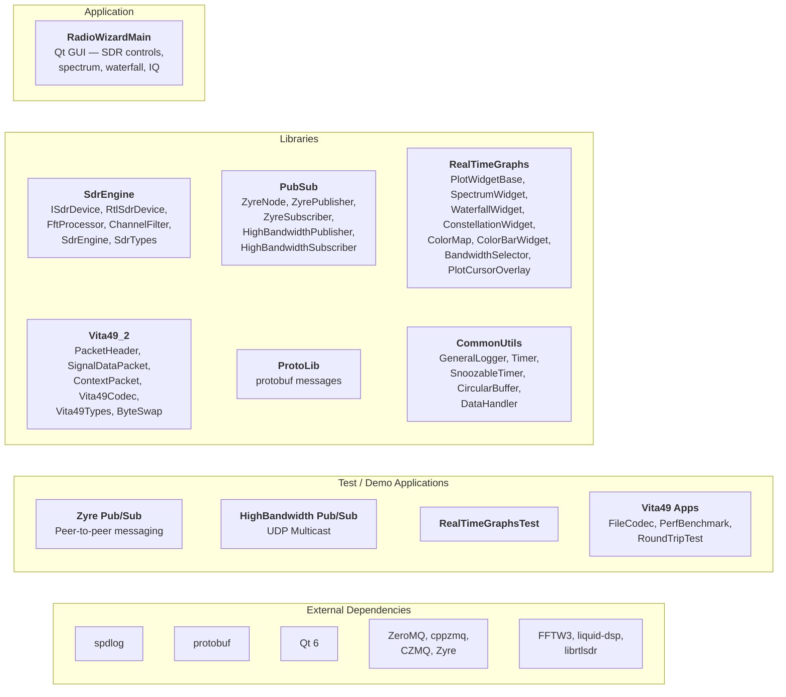

# Project Design

This document describes the architecture and design decisions of the RadioWizard project.

## Overview

RadioWizard is a C++20 application for Software Defined Radio (SDR) control, spectrum and I/Q data observation, signal isolation, and signal demodulation. It interfaces with SDR hardware to capture RF data, visualizes signals in real time, and provides a distributed processing architecture for streaming high-bandwidth I/Q samples between components.

## Architecture

### Component Diagram

### Libraries

#### CommonUtils Library (`src/libs/CommonUtils/`)

The CommonUtils library provides reusable components for common tasks:

- **GeneralLogger**: An async logging wrapper around spdlog providing:
  - Dual-logger system (general + trace)
  - Convenience macros (GPCRIT, GPERROR, GPWARN, GPINFO, GPDEBUG, GPTRACE)
  - Async logging with configurable queue size
  - Thread-safe initialization

- **Timer**: A basic timer class:
  - Periodic and single-shot modes
  - Callback-based design
  - Thread-safe start/stop operations
  - Millisecond precision

- **SnoozableTimer**: An extended timer with snooze capability:
  - Inherits from Timer
  - Snooze functionality to extend timeout
  - Useful for implementing watchdog patterns

- **DataHandler**: Data handling utilities (header-only):
  - Thread-safe queue that dispatches data to registered listener callbacks
  - Runs listeners on a dedicated worker thread, decoupling producers from consumers
  - Template-based for flexible data types

- **CircularBuffer**: Fixed-capacity circular buffer (header-only):
  - Template-based for arbitrary element types
  - Silently overwrites the oldest entries when full
  - Used for time-series history (e.g., waterfall scan lines)

#### PubSub Library (`src/libs/PubSub/`)

The PubSub library provides two messaging patterns:

**Zyre-based Messaging** (peer-to-peer discovery):

- **ZyreNode**: Base class for Zyre nodes:
  - Automatic peer discovery via UDP beaconing
  - Node lifecycle management (start/stop)
  - Thread-safe operation

- **ZyrePublisher**: Publishes messages via Zyre:
  - Inherits from ZyreNode
  - Publishes protobuf messages to topics
  - Automatic peer discovery

- **ZyreSubscriber**: Subscribes to messages via Zyre:
  - Inherits from ZyreNode
  - Topic-based subscription with callbacks
  - Background receive thread

**High-Bandwidth Messaging** (UDP multicast):

- **HighBandwidthPublisher**: Fast UDP multicast publisher:
  - Raw UDP multicast for minimal overhead
  - Automatic message fragmentation for large payloads
  - Fire-and-forget semantics (unreliable but fast)
  - Ideal for sensor data, telemetry, video frames

- **HighBandwidthSubscriber**: Fast UDP multicast subscriber:
  - Joins multicast group for receiving
  - Automatic fragment reassembly
  - Configurable reassembly timeout
  - Thread-safe subscription (can subscribe before or after start)

#### SdrEngine Library (`src/libs/SdrEngine/`)

The SdrEngine library provides a Qt-free SDR device abstraction and DSP processing
pipeline. It uses `DataHandler` (CommonUtils) for data distribution to downstream
consumers.

- **ISdrDevice**: Abstract interface for SDR hardware:
  - Device-agnostic API for tuning, gain control, sample rate, and async streaming
  - Implementations wrap specific hardware APIs behind a common surface

- **RtlSdrDevice**: Concrete ISdrDevice for RTL-SDR hardware:
  - Wraps the librtlsdr C API
  - Async streaming on a dedicated thread via `rtlsdr_read_async`

- **FftProcessor**: Windowed FFT processing:
  - Produces magnitude spectrum in dB using FFTW
  - Thread-safe reconfiguration of FFT size and window function
  - Supports Hann, Hamming, Blackman-Harris, and flat-top windows

- **ChannelFilter**: Channel isolation from wideband I/Q:
  - Frequency-shifts a selected channel using an NCO (liquid-dsp)
  - Band-pass filters with a FIR filter
  - Decimates to match the selected bandwidth via multi-stage resampling

- **SdrEngine**: High-level orchestrator:
  - Owns an ISdrDevice, FftProcessor, and two DataHandlers (spectrum + raw I/Q)
  - Runs an async device → FFT → publish pipeline on dedicated threads

- **SdrTypes**: Common value types:
  - `IqSample` (complex float), `IqBuffer` (timestamped I/Q chunk with metadata),
    `SpectrumData` (FFT magnitude spectrum with metadata)

Dependencies: FFTW3 (FFT), liquid-dsp (filters, NCO, resampling), librtlsdr (RTL-SDR
hardware), CommonUtils.

#### RealTimeGraphs Library (`src/libs/RealTimeGraphs/`)

The RealTimeGraphs library provides custom QPainter-based widgets for real-time
signal visualization.

- **PlotWidgetBase**: Abstract base class for frequency-domain plot widgets that
  centralises cursor overlay, bandwidth selector, and shared mouse-interaction logic
- **SpectrumWidget**: Real-time spectrum (frequency-domain) bar-chart display with
  per-bin coloring from the active ColorMap
- **WaterfallWidget**: Waterfall / spectrogram display where each new row scrolls
  upward, backed by a CircularBuffer of scan lines
- **ConstellationWidget**: IQ constellation diagram with fading older points
- **ColorMap**: Pre-built 256-entry color lookup tables (Viridis, Inferno, etc.)
- **ColorBarWidget**: Color-map gradient strip with interactive dB-range spin boxes
- **BandwidthSelector**: Manages bandwidth cursor state including half-width in Hz,
  mouse-wheel scaling with clamping, and Hz-to-fraction conversion
- **PlotCursorOverlay**: Reusable, axis-agnostic cursor overlay providing a tracking
  crosshair, two double-click measurement cursors, and a delta readout box
- **CommonGuiUtils**: Utility function to convert frequency in Hz to a human-readable
  string (Hz/kHz/MHz/GHz)

Dependencies: Qt6::Core, Qt6::Gui, Qt6::Widgets, Qt6::OpenGLWidgets, spdlog,
CommonUtils.

CMake enables `AUTOMOC` on this target so that Qt signals/slots are processed
automatically.

#### Proto Library (`src/libs/proto/`)

The protocol buffer library compiles `.proto` files from `src/libs/proto/proto-messages/` into C++ classes:

- **sensor_data.proto**: Sensor readings with metadata, location, and batching
- **commands.proto**: Command/response pattern for SDR control RPC
- **configuration.proto**: Application and SDR configuration structures

#### Vita49_2 Library (`src/libs/Vita49_2/`)

The Vita49_2 library implements the VITA 49.2 standard for signal data and context
packet encoding/decoding, enabling interoperability with other SDR and signal
processing systems:

- **PacketHeader**: VITA 49 packet header parsing and construction
- **SignalDataPacket**: Encode and decode signal (I/Q) data packets
- **ContextPacket**: Encode and decode context packets carrying metadata (frequency, bandwidth, gain, etc.)
- **Vita49Codec**: High-level codec for reading/writing VITA 49 packet streams to files
- **Vita49Types**: Type definitions and constants for the VITA 49.2 standard
- **ByteSwap**: Endian conversion utilities for network byte order compliance

### Applications (`src/TestApps/`) and Main Application

#### RadioWizardMain (`src/RadioWizardMain/`)

The main Qt application:
- Hosts the SdrEngine controls, spectrum/waterfall display, and constellation diagram
- Links to RealTimeGraphs, SdrEngine, and CommonUtils
- Uses Qt Designer `.ui` form for layout

#### ZyrePublisher (`src/TestApps/ZyrePublisherTest.cpp`)

Demonstrates:
- Zyre peer-to-peer publishing
- Protocol buffer serialization (SensorReading, SensorDataBatch, Command)
- Periodic message publishing
- GeneralLogger usage

#### ZyreSubscriber (`src/TestApps/ZyreSubscriberTest.cpp`)

Demonstrates:
- Zyre peer-to-peer subscription
- Protocol buffer deserialization
- Topic-based message handling
- Formatted logging with spdlog

#### HighBandwidthPublisher (`src/TestApps/HighBandwidthPublisherTester.cpp`)

Demonstrates:
- High-frequency UDP multicast publishing
- Large message fragmentation
- I/Q and sensor data streaming

#### HighBandwidthSubscriber (`src/TestApps/HighBandwidthSubscriberTester.cpp`)

Demonstrates:
- UDP multicast subscription
- Fragment reassembly
- High-throughput I/Q data reception

#### RealTimeGraphsTest (`src/TestApps/RealTimeGraphsTest.cpp`)

Demonstrates:
- Interactive Qt application using the RealTimeGraphs widget library
- Spectrum, waterfall, and constellation displays for SDR data

#### Vita49FileCodec (`src/TestApps/Vita49FileCodec.cpp`)

Demonstrates:
- Encoding and decoding VITA 49.2 packets to/from files
- Round-trip validation of signal data and context packets

#### Vita49PerfBenchmark (`src/TestApps/Vita49PerfBenchmark.cpp`)

Demonstrates:
- Performance benchmarking of VITA 49 packet encode/decode
- Throughput measurement for real-time processing viability

#### Vita49RoundTripTest (`src/TestApps/Vita49RoundTripTest.cpp`)

Demonstrates:
- End-to-end round-trip validation of VITA 49 packet construction and parsing
- Data integrity verification

## Design Decisions

### Build System

**CMake** was chosen as the build system because:
- Industry standard for C++ projects
- Excellent IDE integration
- Cross-platform support
- Modern features (presets, toolchain files)

**Conan 2.0** was chosen for package management because:
- Mature ecosystem with many packages
- First-class CMake integration
- Cross-platform support
- Binary package caching

### Code Quality

**clang-format** ensures consistent code style:
- 3-space indentation
- Allman brace style (braces on new line)
- 100-character line limit

**clang-tidy** provides static analysis:
- Modern C++ best practices
- Bug detection
- Performance suggestions
- Naming conventions

### Testing Strategy

**Google Test** was chosen because:
- Widely used in industry
- Feature-rich (fixtures, mocking, parameterized tests)
- Good IDE integration
- Clear test output

Test organization:
- One test file per source file
- Tests mirror the source structure
- Fixtures for common setup/teardown

### Sanitizers

Address Sanitizer (ASan) and Undefined Behavior Sanitizer (UBSan) are enabled in debug builds to catch:
- Memory leaks
- Buffer overflows
- Use-after-free
- Undefined behavior

### Code Coverage

Coverage is collected using gcov/lcov:
- Line and branch coverage
- HTML report generation
- CI integration with Codecov

## Future Considerations

Areas for potential enhancement:

1. **Additional SDR Hardware Drivers**: Extend ISdrDevice with SoapySDR, USRP, or HackRF implementations alongside the existing RTL-SDR driver
2. **Signal Demodulation**: Implement demodulation chains (AM, FM, SSB, PSK, QAM, etc.) using the existing ChannelFilter and liquid-dsp infrastructure
3. **Signal Isolation**: Automatic signal detection and isolation from wideband captures
4. **Extended DSP Pipeline**: Expand the SdrEngine pipeline with additional processing stages (decimation chains, AGC, etc.)
5. **Benchmarking**: Add Google Benchmark for DSP performance testing
6. **Documentation**: Add Doxygen for API documentation generation
7. **Packaging**: Add CPack for installers/packages
8. **Embedded Targets**: Add toolchain files for cross-compilation to SDR platforms
9. **Fuzzing**: Add libFuzzer for fuzz testing of packet parsers
